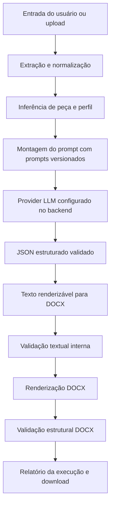

# Arquitetura

O `Sistema de Petições` é um pipeline local AI-first para criação, validação e renderização supervisionada de documentos jurídicos em `.docx`.

## Princípios

1. **Uso supervisionado:** o sistema nunca substitui revisão de advogado.
2. **IA obrigatória no fluxo principal:** todo documento criado passa pela camada LLM configurada no backend.
3. **Configuração centralizada:** provider, modelo, temperatura, timeout e prompts vêm do backend.
4. **Validação em camadas:** resposta LLM, texto renderizável e DOCX final são verificados em etapas diferentes.
5. **Runtime local:** documentos, relatórios e filas ficam fora do Git.

## Visão Geral do Fluxo



## Estrutura de Camadas

```text
src/
  core/            domínio, perfis, tipos, prompts e validações
  adapters/        inbox, outbox e extração de arquivos
  infra/           DOCX, LLM, locks, logging e estado local
  interfaces/      API, CLI e desktop
  orchestration/   pipeline, relatórios, retenção e setup
```

## Camada LLM

A camada LLM fica isolada em `src/infra/llm/`.

- `schemas.py`: modelos Pydantic para resposta estruturada.
- `prompting.py`: montagem do prompt final.
- `redaction.py`: mascaramento parcial antes de provider externo.
- `base.py`: interface base de provider.
- `factory.py`: seleção de provider baseada no backend.
- `mock_provider.py`: provider determinístico para testes/desenvolvimento.
- `openai_provider.py`: provider real via HTTP.
- `anthropic_provider.py`: provider real Anthropic/Claude via Messages API.
- `ollama_provider.py`: provider local via REST API do Ollama.
- `rendering.py`: conversão de `LegalDocumentDraft` para texto renderizável.

Regras:

- `LLM_REQUIRED=true` torna a IA obrigatória na criação.
- `LLM_PROVIDER=mock` é o padrão seguro de desenvolvimento/teste.
- `LLM_PROVIDER=openai` exige `OPENAI_API_KEY`.
- `LLM_PROVIDER=anthropic` exige `ANTHROPIC_API_KEY`.
- `LLM_PROVIDER=ollama` usa `OLLAMA_BASE_URL` e nao exige chave externa.
- `LLM_ALLOW_CLIENT_PROVIDER=true` permite escolher provider/modelo na UI/API dentro da allowlist do backend.
- Providers externos exigem consentimento explícito por requisição.
- Redaction reduz exposição, mas não garante anonimização completa.
- O prompt completo não deve ser salvo por padrão.

## Modos de Saída

- `minuta`: modo padrão de criação, permite pendências revisáveis.
- `final`: aplica bloqueios formais mais rígidos.
- `triagem`: depreciado na API/interface principal; validações continuam internas ao fluxo de criação.

## Relatórios

Relatórios JSON/HTML ainda são gerados em `reports/` para auditoria da execução atual e download pela resposta da API. A interface web não apresenta histórico recente como funcionalidade principal.

## Segurança

Pontos existentes:

- API versionada em `/api/v1`.
- CORS configurado.
- Origin check em rotas mutadoras.
- Headers de segurança.
- Rate limit local.
- Proteção contra path traversal em downloads.
- `.env`, `output/`, `reports/` e `mcp_*.json` fora do Git.
