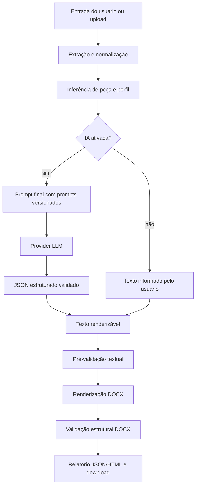

# Arquitetura

O `Sistema de Petições` é um pipeline local para geração, validação e renderização supervisionada de documentos jurídicos em `.docx`.

## Princípios

1. **Uso supervisionado:** o sistema nunca substitui revisão de advogado.
2. **IA opcional:** o fluxo padrão não envia dados para fora.
3. **Validação em camadas:** texto, resposta LLM e DOCX final são verificados em etapas diferentes.
4. **Runtime local:** documentos, relatórios e filas ficam fora do Git.
5. **Arquitetura simples:** camadas separadas sem overengineering.

## Visão Geral do Fluxo



## Estrutura de Camadas

```text
src/
  core/
  adapters/
  infra/
  interfaces/
  orchestration/
```

### `core/`

Domínio puro e regras reutilizáveis:

- `src/core/domain.py`: tipos compartilhados como `ProcessResult` e `PipelineSummary`.
- `src/core/profiles.py`: perfis formais de validação.
- `src/core/piece_types.py`: catálogo de tipos de peça.
- `src/core/piece_inference.py`: detector determinístico de tipo de peça.
- `src/core/prompts.py`: carregamento e auditoria dos prompts versionados.
- `src/core/validation/`: validações textuais, modos de saída e validação estrutural DOCX.

### `adapters/`

Integrações de entrada, saída e arquivos:

- `src/adapters/inbox/gmail_reader.py`: leitura de inbox JSON/mock.
- `src/adapters/outbox/gmail_sender.py`: escrita de outbox JSON local.
- `src/adapters/files/file_extractors.py`: extração de texto de uploads.

### `infra/`

Detalhes técnicos locais:

- `src/infra/docx_render.py`: renderizador DOCX determinístico.
- `src/infra/llm/`: providers LLM, schemas, prompt builder e conversão de draft estruturado para texto.
- `src/infra/pipeline_state.py`: estado local de processamento.
- `src/infra/file_lock.py`: lock cooperativo para arquivos.
- `src/infra/logging.py`: logging para CLI/API.

### `interfaces/`

Pontos de entrada:

- `src/interfaces/api.py`: API FastAPI em `/api/v1`.
- `src/interfaces/cli.py`: CLI via `python -m src`.
- `src/interfaces/desktop.py`: interface Tkinter.

### `orchestration/`

Fluxos de aplicação:

- `src/orchestration/pipeline.py`: pipeline principal.
- `src/orchestration/reporting.py`: relatórios JSON/HTML.
- `src/orchestration/history.py`: histórico local.
- `src/orchestration/setup.py`: criação/verificação de pastas.
- `src/orchestration/retention.py`: retenção e limpeza.

## Camada LLM

A camada LLM fica isolada em `src/infra/llm/`.

Arquivos principais:

- `schemas.py`: modelos Pydantic para resposta estruturada.
- `prompting.py`: montagem do prompt final.
- `redaction.py`: mascaramento de dados pessoais e neutralização básica antes de provider externo.
- `base.py`: interface base de provider.
- `factory.py`: seleção de provider.
- `mock_provider.py`: provider determinístico para testes.
- `openai_provider.py`: provider real via HTTP.
- `rendering.py`: conversão de `LegalDocumentDraft` para texto renderizável.

Regras:

- O modo padrão é `none`.
- `mock` só deve ser tratado como desenvolvimento/teste.
- `openai` exige `OPENAI_API_KEY`.
- Providers externos exigem consentimento explícito por requisição.
- Antes da chamada externa, padrões como CPF, CNPJ, NIT, NB, RG, CEP, telefone e e-mail são mascarados.
- O prompt completo não deve ser salvo por padrão.
- O relatório registra hashes e metadados, não chaves nem prompt completo.

## Modos de Saída

- `minuta`: gera DOCX mesmo com alertas formais não críticos.
- `final`: bloqueia placeholders, marcas internas, dados fictícios e pendências críticas.
- `triagem`: valida sem gerar DOCX.

## Relatórios

Relatórios são gerados em `reports/`:

- JSON para auditoria técnica.
- HTML para leitura local.

Eles podem conter dados sensíveis e não devem ser versionados.

## Segurança

Pontos já existentes:

- API versionada.
- CORS configurado.
- Origin check em rotas mutadoras.
- Headers de segurança.
- Rate limit local.
- Proteção contra path traversal em downloads.
- `.env` ignorado pelo Git.
- `output/` e `reports/` fora do Git.

Pontos que exigem cuidado operacional:

- Dados reais em uploads e relatórios.
- Uso de IA externa com textos jurídicos sensíveis.
- Compartilhamento de DOCX gerado.
- Retenção local dos arquivos.

## Testes

A suíte cobre:

- configuração;
- API;
- geração e validação DOCX;
- modos de saída;
- inferência de tipo de peça;
- extração de arquivos;
- relatório HTML;
- integração LLM mock;
- erro claro para provider real sem chave;
- CLI e pipeline.

Comandos:

```bash
python -m compileall config.py src tests
pytest -q
```
